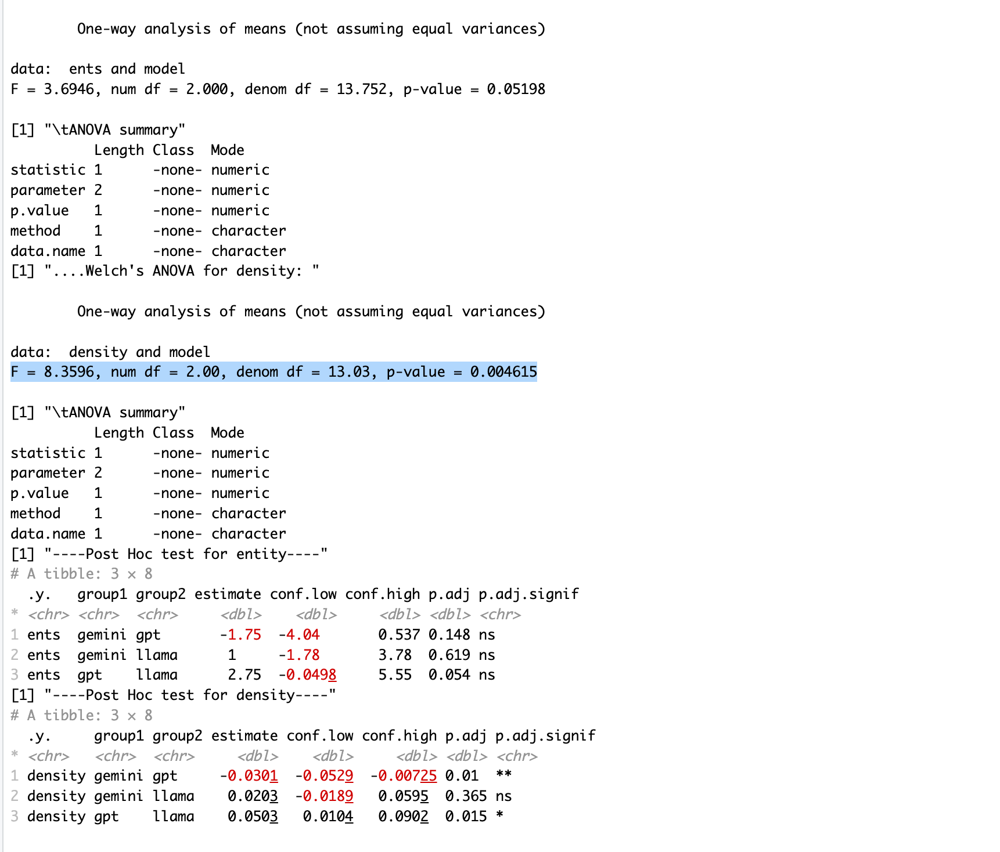
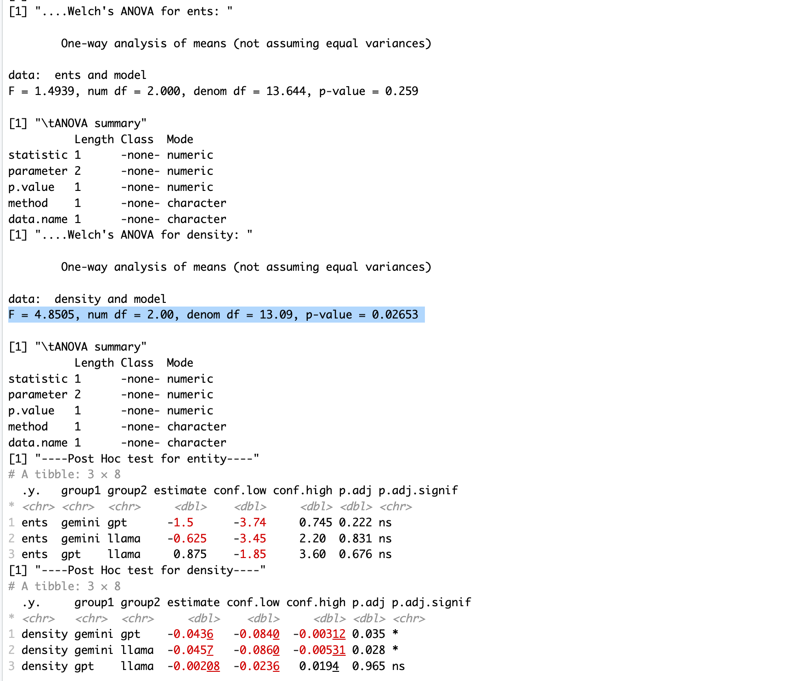
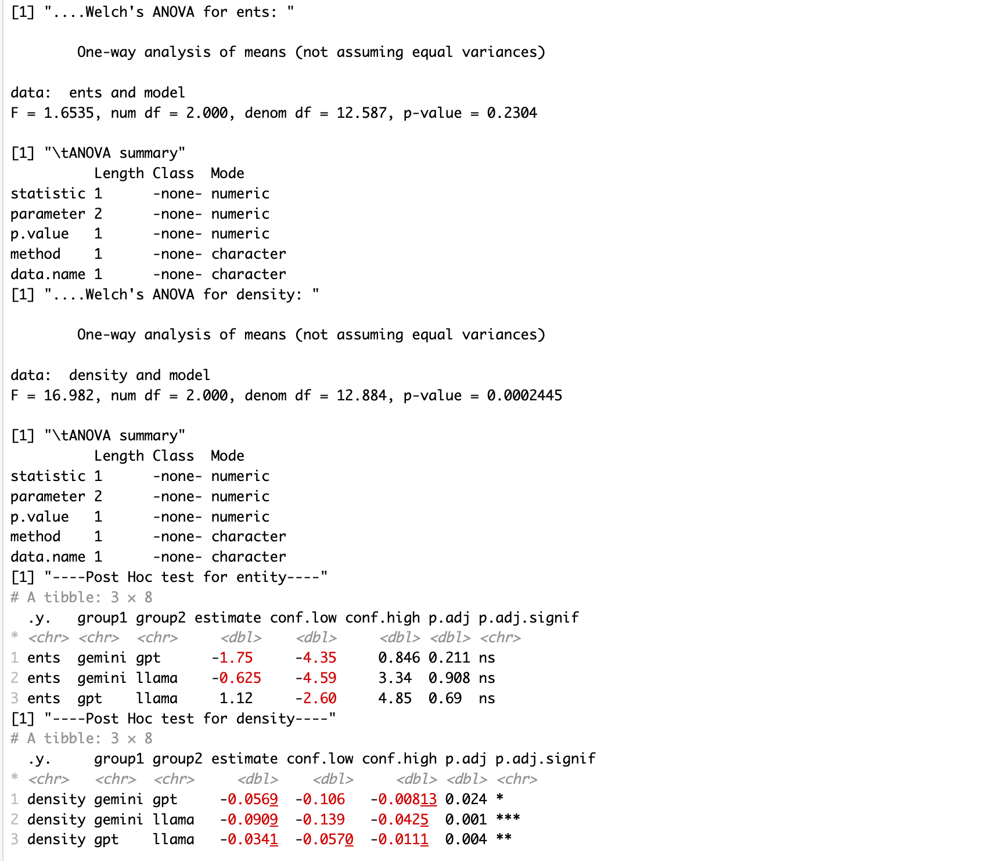
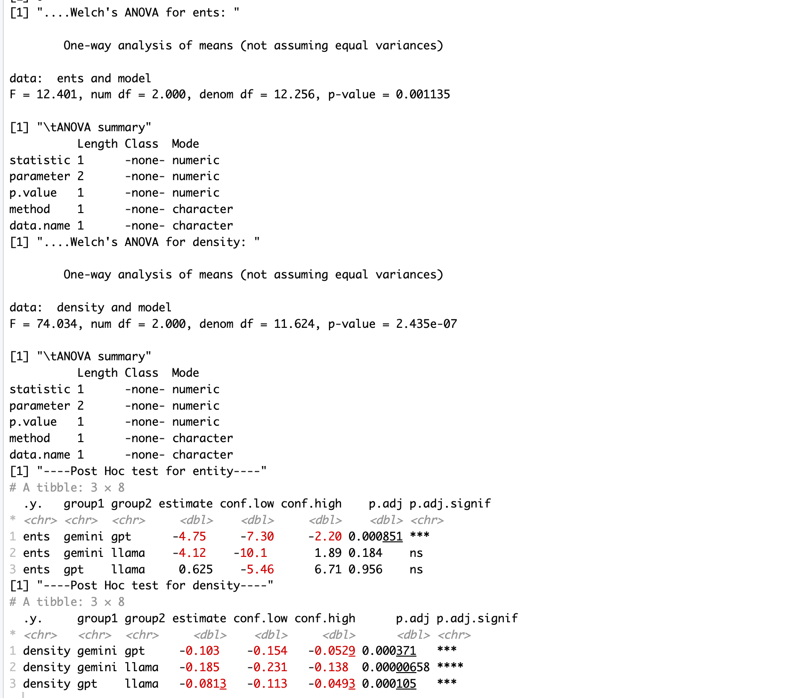

# Mobile Application Review Summarization with Chain of Density Prompting
Summary of this paper: Analyzed the Chain of Density Prompting technique to summarize mobile application reviews from App Store.


## Code Structure
The Scripts repository is split into six notebooks:
- [0__Data_Collection](./Data_Collection.ipynb) - contains the code for downloading app reviews from AppStore using the library *app_store_scraper*.
- [1__Data_Preprocessing](./Data_Preprocessing.ipynb) - contains the code for text pre-processing techniques, including noise keyword removals, tokenizer, stopwords removal and lemmatizer.
- [2__Summary_Generation](./Summary_Generation.ipynb) - contains the code for summary generation. There are **three types of prompts** used for summarization on the GPT-4 model:
    - **vanilla**: prompt simply states the task without providing specifics on "how to perform the task"
    ```code
    You will summarize the app store reviews (delimited with XML tags) for {{app}} app in {{summary_length}} words.
    ```
    - **CoD**: Adams et al. [arxiv:2309.04269](https://huggingface.co/papers/2309.04269) proposed the chain of density prompting that guides the language model into producing summaries iteratively. In each iteration, new named entities (1-3) are added to the summary without losing the entities from the previous iterations. The authors used news-articles as their dataset.
    - **CoD_R**: We modified the chain of density prompt proposed by Adams to incorporate the summarization of mobile app reviews. In particular, we define a `missing entity` as a user defined issue that is related to the functional feature or non-functional aspect of the app. Unlike named entities, app reviews summaries should include entities that impact (improve or harm) users' experiences. 
    ```code
    Instructions:
    You will generate increasingly concise, entity-dense summaries of the reviews (delimited with XML tags) of the {{app}} app.
    Repeat the following 2 steps {{iterations}} times.
    Step 1:	Identify {{num_missing_entities}} informative entities from the reviews which are missing from the previously generated summary.
    Step 2:	Write a new, denser summary of identical length which covers every entity and detail from the previous summary plus the missing entities.
    Note: An entity is a user-defined issue in the reviews that is perceived to harm or support their goals. This includes the functional or non-functional features of the app.

    A missing entity is:
    - relevant to the app’s operation,
    - specific yet concise (5 words or fewer),
    - novel (not in the previous summary),
    - faithful (present in the reviews),
    - anywhere (can be located anywhere in the reviews).

    Guidelines:
    - The first summary should be long (4-5 sentences, {{summary_length}} words) yet highly non-specific, containing little information beyond the entities marked as missing.
    - Use overly verbose language and fillers (e.g., "this app discusses") to reach {{summary_length}} words.
    - Make every word count: rewrite the previous summary to improve flow and make space for additional entities.
    - Make space with fusion, compression, and removal of uninformative phrases like "the users discuss".
    - The summaries should become highly dense and concise yet self-contained, i.e., easily understood without the reviews.
    - Missing entities can appear anywhere in the reviews. NEVER drop entities from the previous summary.
    - If space cannot be made, add fewer new entities. Remember, use the exact same number of words for each summary.
    - Avoid apps' names other than {{app}} in the summaries.
    - Avoid personal and location specific information like name, place, URLs, and emails

    Remember, use the exact number ({{summary_length}}) of words for each summary.
    ONLY Answer in JSON. The JSON should be a list (length {{iterations}}) of dictionaries whose keys are "Iteration turn", "Missing_Entities", "Denser_Summary".
    ```
    Additionally, we also curated a set of **baseline summaries** for each app in our dataset using the Hybrid Term Frequency Inverse Document Frequency (TF.IDF) method. [Scripts > Summary_Generation.ipynb](./Scipts/Summary_Generation.ipynb) contains the code for generating such summaries.


    To evaluate the performance of `CoD_R prompting on other emerging LLMs`, we created summaries using two new LLMs, `Gemini-1.5-Flash` (released in May 2024) and `Llama-3.1-70B-Instruct` (released in July 2024). Both models support large context window of 1M and 128K tokens respectively. These LLMs are selected for their competitive performance on several text generation tasks and over multiple benchmarks.

    - Summaries prompted on Llama model are [available here](./data/summaries/llama-summaries/) 
    - Summaries prompted on Gemini model are [available here](./data/summaries/gemini-summaries/)
    - The CoD_R prompt and parameters used on these models for summary generation are the same as we used on OpenAI's GPT-4 model.

- [3__Entity_Analysis](./Entity__Analysis.ipynb): contains the analysis of entities in the generated summaries. It includes entity counts and density computation of baseline summaries and at each iteration of the chain of density summaries (generated using OpenAI's GPT-4 model). 
    - [Other_LLMs_Entity_Analysis.R](./Scipts/Other_LLMs_Entity_Analysis.R) contains R scripts for testing average values of entities and densities for three types of summaries across five iterations. 
- [4__User_Study](./Survey_Analysis.ipynb): contains the results of our user study in which we conducted a survey among 48 senior year students of Computer Science enrolled in a reputed research university in the United States. The aim is to assess the readability of the CoD_R prompted summaries (generated using OpenAI' GPT-4 model) generated at 3rd, 4th and 5th iterations. The digital copies of the submitted survey forms with participants responses are available [in a PDF format](./data/survey).

## Data Structure
The data directory is structured as follows:
- [data > prompts](./data/prompts) contains the three prompts (CoD, CoD_R, and Vanilla) used in our study.
- [data > reviews](./data/reviews/) contains the review dataset used in our analysis.
    - [raw reviews](./data/reviews/raw%20reviews/) contains raw reviews scraped from the Apple appstore.
    - [sampled for summarization](./data/reviews/sampled%20for%20summarization) contains sampled review dataset (from the raw review dataset) used for summary generation.
        - [subsamples for recall analysis](./data/reviews/sampled%20for%20summarization/subsamples%20for%20recall%20analysis/) contains subset source reviews (randomly sampled from `summary samples` dataset) used for entity recall analysis.
            - [labelled entities count](./data/reviews/sampled%20for%20summarization/subsamples%20for%20recall%20analysis/labelled%20entities%20count) contains JSON files for each app showing the frequency counts of unique labelled entities.
            - [labelled entities classes](./data/reviews/sampled%20for%20summarization/subsamples%20for%20recall%20analysis/labelled%20entitities%20classes) contains JSON files for each app showing grouped classes of labelled entities for each app.
- [data > summaries](./data/summaries/) contains the csv files of the summaries generated using the Hybrid TF.IDF method and using three prompts (Vanilla, CoD, and CoD_R) on OpenAI's GPT-4 model. Each summary is labelled with entities extracted via a manual process. An entity describes the app's features and services that enhance or degrade user experiences. 
    - [other-llms-ents-density-len-v1.csv](./data/summaries/other-llms-ents-density-len-v1.csv) contains values of entities, entity density and summary length (words) for CoD_R summaries generated using the GPT, Llama, and Gemini models. The file has the following format:
        - `model`: label for the LLM used for summary generation
        - `app`: name of the app 
        - `itr`: iteration number (total of 5 iterations for each app)
        - `ents`: number of entities manually identified in each summary
        - `length`: number of words in a summary after simple preprocessing (e.g. punctuations removal)
        - `density`: ratio of number of entities to summary length (number of words)

- [data > survey](./data/survey) contains the digital copies of the responses from the user study. The directory includes
    - [Survey Responses Session 1](./data/survey/survey-responses-session-1.pdf): All digital copies of the first session survey forms containing GPT-4 summaries generated at iterations 3, 4, and 5. These forms contain participants responses to the readability question. 
    - [Survey Responses Session 2](./data/survey/survey-responses-session-2.zip): All digital copies of the second session survey forms. 
    - [Survey Results](./data/survey/survey-results.csv): Responses from participants are summarized into a single CSV file.

## Replication Requirements
- install dependencies using `pip install -r requirements.txt`
- The implementation consumes minimal space and is completed within 8-10 minutes.
    - Lemmatization process takes slighly more time (on average 5 minutes) depending on the number of reviews. Other than that, summarization takes 2-3 minutes to complete for each app.
    - In most cases, outputs are written to csv files.
    - A normal system with 8 GB RAM and 1GB storage is sufficient. 
    - To use OpenAI models, you need an API key for authorization. 
        - For pricing, see the [pricing link.](https://openai.com/pricing)
        - To select appropriate models, visit the [models description page](https://platform.openai.com/docs/models).
        - For prompt engineering, checkout the [articles](https://help.openai.com/en/articles/6654000-best-practices-for-prompt-engineering-with-the-openai-api) and [guides](https://platform.openai.com/docs/guides/prompt-engineering/six-strategies-for-getting-better-results) here.
    - The average latency of the Gemini model (using the Google's API) is around 1 minute, whereas, responses from the Llama model (using the Amazon BedRock API) take around 3-5 minutes. Ensure that you have API credentials for these APIs. If not, check out the following resources:
        - [Google AI Dev Docs](https://ai.google.dev/gemini-api/docs)
        - [What is Amazon Bedrock?](https://docs.aws.amazon.com/bedrock/latest/userguide/what-is-bedrock.html)
            - [Amazon Bedrock API requests through the AWS SDK for Python (Boto3)](https://docs.aws.amazon.com/bedrock/latest/userguide/getting-started-api-ex-python.html)


## Outputs from Entity/Density Analysis of three types of Summaries

- [Scripts > Other_LLMs_Entity_Analysis.R](./Scipts/Other_LLMs_Entity_Analysis.R) contains the full R scripts. 
- For each iteration, we perform the following tests:
    - Normality test to check values in each group (model) is normally distributed.
    - Test for Homogeneous Variance to check all groups share the same variance (some do not)
    - One Way Analysis of Variance test is conducted to check if mean of any of the groups is significantly different than others. We assume unequal variances among groups.
    - Post Hoc Analysis for pairwise group comparison
        - Since we used Welch's one way ANOVA, we use Games-Howell test.
- In what follows, we present screenshots of our results from the one way ANOVA and Post Hoc tests. These tests are conducted to compare average entities and average densities across different summaries through iteration 1 to 5.

### Iteration 1




### Iteration 2




### Iteration 3



### Iteration 4


### Iteration 5



